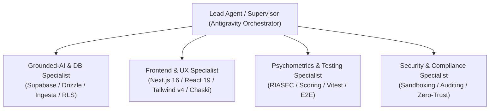

<!-- BEGIN:nextjs-agent-rules -->

# This is NOT the Next.js you know

This version has breaking changes — APIs, conventions, and file structure may all differ from your training data. Read the relevant guide in `node_modules/next/dist/docs/` (resolved from this file's directory; in monorepos the `next` package may not be visible from the repo root) before writing any code. Heed deprecation notices.

This block is written and re-added by `next dev` — verify at `node_modules/next/dist/server/lib/generate-agent-files.js`. Removing it from a diff only re-creates the uncommitted change; committing it with your work keeps the tree clean.

<!-- END:nextjs-agent-rules -->

# Antigravity Multi-Agent Directives: Orientador Vocacional IA

Este archivo define la gobernanza, las reglas de arquitectura y el sistema multi-agente de Antigravity para el proyecto **Orientador Vocacional IA**. Todo agente o subagente que opere en este repositorio debe cumplir estrictamente con estas directivas.

---

## 1. Misión y Filosofía Central: Grounded AI (Cero Alucinaciones)

1. **La base de datos PostgreSQL (Supabase) es la única fuente de hechos:** Ningún agente ni modelo de lenguaje (LLM) debe inventar, extrapolar ni deducir nombres de carreras, pensiones, mallas curriculares, requisitos de admisión o porcentajes de empleabilidad.
2. **Trazabilidad obligatoria:** Todo dato cuantitativo mostrado debe respaldarse en registros verificados vinculados a la tabla `sources`.
3. **Manejo de vacíos de información:** Si un dato no existe en la base de datos auditada, la respuesta debe ser: *"Información no disponible actualmente en nuestras fuentes oficiales registradas"*.
4. **Protección de Datos:** Prohibido realizar sentencias destructivas (`DROP TABLE`, `TRUNCATE`, o borrado masivo) sin autorización explícita previa del usuario.

---

## 2. Equipo de Subagentes Especializados en Antigravity

Para tareas complejas, el agente supervisor delega el trabajo en 4 subagentes especializados:

### A. Subagente `grounded-ai-dba` (Base de Datos e IA Verificada)
* **Alcance:** `src/db/`, `scripts/`, `docs/architecture/`, `docs/data/`, `src/app/api/chat/`.
* **Responsabilidades:** Modelado de esquemas en Drizzle ORM, validación de migraciones SQL, enriquecimiento contextual sin alucinaciones y mantenimiento de integridad referencial.
* **Skill Asociado:** `.agents/skills/grounded-ai/SKILL.md`

### B. Subagente `frontend-chaski-ui` (Experiencia de Usuario e Interfaz)
* **Alcance:** `src/components/`, `src/app/`, `src/constants/`, `public/`.
* **Responsabilidades:** Implementar componentes accesibles y responsivos con Tailwind CSS v4, animaciones con Framer Motion, gráficos de radar RIASEC con Recharts y exportación fiel de informes PDF.
* **Skills Asociados:** `.agents/skills/ui-styling/`, `.agents/skills/design-system/`

### C. Subagente `psychometrics-qa` (Calidad y Calibración Psicométrica)
* **Alcance:** `src/data/questionnaireData.ts`, `src/constants/dimensions.ts`, `src/__tests__/`, `vitest.config.ts`.
* **Responsabilidades:** Validar la calibración de las 16 interacciones en 4 misiones vocacionales, asegurar que las fórmulas de scoring y compatibilidad no se degraden y ejecutar suites en Vitest tras cada cambio.
* **Skill Asociado:** `.agents/skills/psychometrics-qa/SKILL.md`

### D. Subagente `supervisor-architect` (Lead Orchestrator)
* **Alcance:** Coordinación general del proyecto, gestión de ramas de trabajo (`branch` workspaces en Antigravity) y resolución de conflictos.

---

## 3. Estándares Técnicos del Stack

| Componente | Versión / Tecnología | Regla Obligatoria |
| :--- | :--- | :--- |
| **Framework** | Next.js 16.3+ (App Router) | Usar Server Components por defecto; `'use client'` solo cuando se requiera interactividad o hooks de estado. |
| **UI Library** | React 19 | Aprovechar transiciones y concurrencia sin hooks obsoletos ni dependencias innecesarias. |
| **Estilos** | Tailwind CSS v4 | Seguir el sistema de tokens y colores definido en `docs/architecture/UI_DESIGN_SYSTEM.md`. |
| **ORM** | Drizzle ORM 0.39+ | Validar consultas con `drizzle-zod`. No usar queries crudas sin tipado salvo scripts puntuales de migración. |
| **Testing** | Vitest 5+ | Todo cambio en lógica vocacional o de scoring debe ejecutarse con `npx vitest run`. |
| **Tipado** | TypeScript 5 (Strict) | Compilación con cero advertencias (`npx tsc --noEmit`). Prohibido el uso de `any` no tipado. |

---

## 4. Flujo de Trabajo Operativo para Agentes (Protocolo Senior)

1. **Analizar:** Leer completamente frontend, backend y base de datos antes de intervenir.
2. **Implementar de extremo a extremo:** Soluciones completas, sin placeholders (`// TODO`) ni métodos simulados.
3. **Verificar automáticamente:**
   * Ejecutar `npx vitest run` para pruebas de lógica vocacional.
   * Ejecutar `npx tsc --noEmit` para garantizar la integridad estática de tipos.
4. **Auto-corrección:** En caso de fallos, analizar la causa raíz, corregir y volver a correr las pruebas de inmediato.
5. **Commits Convencionales:**
   * Formato: `feat(scope):`, `fix(scope):`, `docs(scope):`, `test(scope):`, `chore(scope):`.
