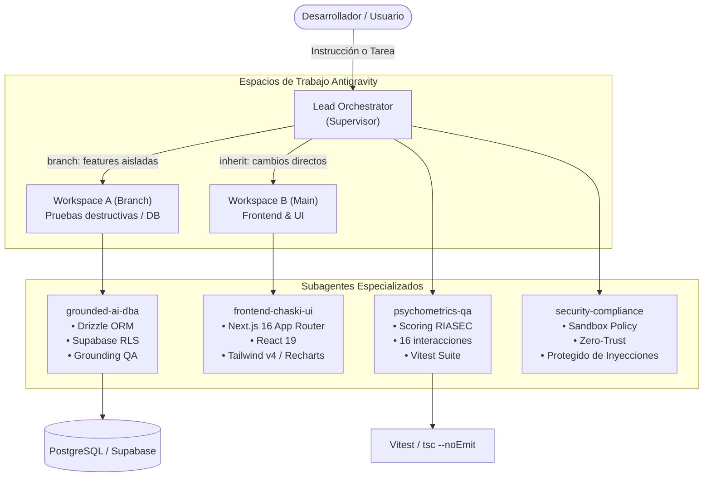

# Arquitectura de Orquestación Multi-Agente: Orientador Vocacional IA

Este documento describe la arquitectura técnica y el modelo operativo para el manejo de agentes y subagentes en **Antigravity** dentro del proyecto **Orientador Vocacional IA**.

---

## 1. Visión General del Sistema Multi-Agente

Para mantener alta velocidad de desarrollo sin degradar la confiabilidad ni introducir alucinaciones en los datos universitarios, el proyecto divide las responsabilidades en **4 subagentes especializados**, coordinados por un **Lead Orchestrator (Supervisor)**:

---

## 2. Roles y Matriz de Responsabilidades (RACI)

| Subagente | Modelo Recomendado | Scope de Archivos | Herramientas Clave | Responsabilidad Primaria |
| :--- | :--- | :--- | :--- | :--- |
| **`supervisor-orchestrator`** | Gemini Pro / Inherit | Global | `invoke_subagent`, `manage_subagents` | Planificación de tareas, asignación y verificación final. |
| **`grounded-ai-dba`** | Gemini Flash / Pro | `src/db/`, `scripts/`, `src/app/api/chat/` | `view_file`, `replace_file_content`, `run_command` | Garantizar cero alucinaciones y validar queries contra Supabase. |
| **`frontend-chaski-ui`** | Gemini Flash | `src/components/`, `src/app/`, `public/` | `replace_file_content`, `write_to_file` | UI/UX responsiva con Tailwind v4, Recharts y avatar Chaski. |
| **`psychometrics-qa`** | Gemini Flash | `src/data/`, `src/constants/`, `src/__tests__/` | `run_command` (`vitest`, `tsc`) | Calibrar 16 preguntas RIASEC y ejecutar tests unitarios. |
| **`security-compliance`** | Gemini Flash Lite | `.env.example`, `docs/rules/`, configs | `view_file` | Auditar variables de entorno, permisos y sandboxing. |

---

## 3. Modos de Aislamiento en Workspaces (Antigravity)

Al invocar subagentes en Antigravity (`invoke_subagent`), se seleccionan los modos de workspace según el riesgo de la tarea:

1. **`Workspace: "inherit"` (Por defecto):**
   * **Uso:** Tareas frontend rutinarias, creación de componentes de presentación o adición de estilos.
   * **Comportamiento:** El subagente edita directamente sobre el directorio de trabajo del proyecto.
2. **`Workspace: "branch"` (Aislamiento de alto riesgo):**
   * **Uso:** Migraciones de base de datos (`docs/architecture/*.sql`), reestructuración de esquemas Drizzle o pruebas de ingesta de datos masiva.
   * **Comportamiento:** Se crea un clon aislado del workspace. Si los tests o las consultas fallan, el código de producción permanece intacto. Solo tras pasar `vitest run` y `tsc --noEmit` los cambios se fusionan.
3. **`Workspace: "share"` (Colaboración git-worktree):**
   * **Uso:** Desarrollo de features paralelas grandes que requieren su propia rama Git sin duplicar `node_modules`.

---

## 4. Progressive Disclosure y Habilidades (Skills)

Para optimizar costos de contexto y evitar alucinaciones, Antigravity no inyecta todas las instrucciones en cada prompt. Utiliza **divulgación progresiva**:

* El subagente solo carga el contenido de `.agents/skills/grounded-ai/SKILL.md` cuando la tarea implica consultar o generar datos universitarios.
* El subagente solo carga `.agents/skills/psychometrics-qa/SKILL.md` cuando se manipulan preguntas del test o algoritmos de compatibilidad.
* Los estilos visuales se cargan desde `.agents/skills/ui-styling/SKILL.md` únicamente al diseñar interfaces.

---

## 5. Protocolo de Calidad y Cierre de Tareas (Definition of Done)

Ningún agente debe dar por concluida una tarea sin cumplir los siguientes 4 pasos:

1. **Verificación Estática:** `npx tsc --noEmit` debe retornar 0 errores.
2. **Pruebas Psicométricas:** `npx vitest run` debe pasar el 100% de los tests unitarios.
3. **Validación de Grounding:** Ningún endpoint o componente debe simular datos no registrados en la tabla `sources`.
4. **Commits Convencionales:** Registro atómico con `feat:`, `fix:`, `docs:`, `test:` o `chore:`.
