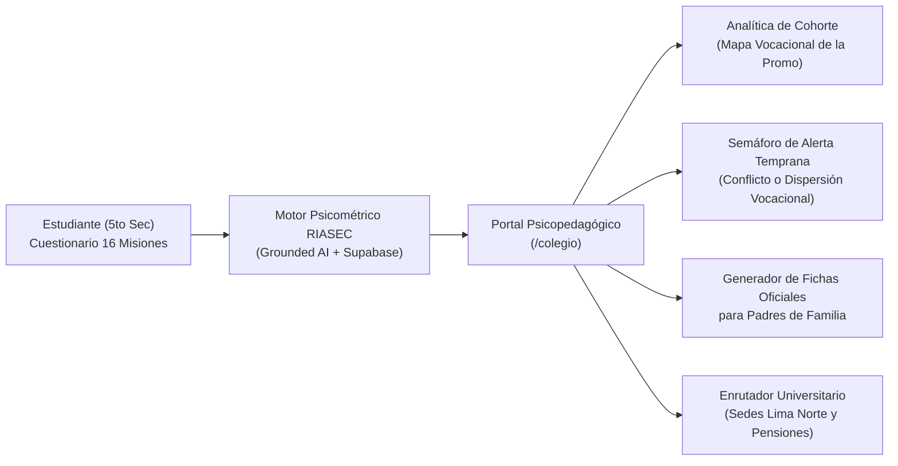

# Arquitectura y Modelo B2B: Portal Psicopedagógico para Colegios de Secundaria

**Proyecto:** Orientador Vocacional IA  
**Módulo:** Plataforma B2B para Instituciones Educativas (Colegios)  
**Público Objetivo:** Directores, Departamentos de Psicología Escolar, Tutores de 5to de Secundaria y Padres de Familia  

---

## 1. La Problemática en los Colegios Secundarios

En el Perú y Latinoamérica, la orientación vocacional en 5to de secundaria enfrenta 3 graves deficiencias estructurales:
1. **Pruebas Psicométricas Manuales Lentas:** Los psicólogos escolares invierten semanas en aplicar y calificar cuestionarios impresos para cientos de alumnos, retrasando las intervenciones oportunas.
2. **Falta de Trazabilidad Universitaria Real:** Los tests tradicionales recomiendan carreras teóricas sin informar costos de pensión, mallas curriculares ni sedes licenciadas por SUNEDU en la zona del colegio (ej. Lima Norte).
3. **Brecha de Comunicación con los Padres de Familia:** Los padres desconocen los resultados detallados o entran en conflicto con las vocaciones de sus hijos por falta de un informe psicopedagógico formal y fundamentado.

---

## 2. Solución B2B: Portal Psicopedagógico Escolar

El módulo `/colegio` transforma el Orientador Vocacional IA en una **suite institucional integral**:

---

## 3. Funcionalidades Principales del Módulo B2B

### A. Analítica de Cohorte y Mapa Vocacional
* Genera el perfil vocacional consolidado de la promoción (ej. Promoción 2026: 28% Salud/Social, 24% Negocios, 18% Arte, 16% Ciencias, 14% Ingeniería).
* Permite a la dirección escolar planificar ferias vocacionales y visitas guiadas a las universidades más afines con la cohorte.

### B. Semáforo de Alerta Temprana (Indecisión / Conflicto)
* **Alta Claridad (>80%):** Estudiantes listos para talleres de postulación y charlas de carrera.
* **Conflicto Vocacional (Bipolar):** Estudiantes con intereses altos en áreas opuestas (ej. Arte vs Software). El sistema sugiere explorar carreras híbridas (Diseño UI/UX, Animación Digital).
* **Perfil Disperso (<40%):** Detección de apatía o desorientación para intervención preventiva del psicólogo del colegio.

### C. Ficha Oficial Imprimible para Padres de Familia
* Documento formal de 1 página que resume el perfil de Holland, el índice de certeza, las universidades licenciadas recomendadas y pautas de acompañamiento para el hogar.

---

## 4. Impacto y Diferenciador Comercial

| Criterio | Test Vocacional Tradicional | Orientador Vocacional IA (Chaski B2B) |
| :--- | :--- | :--- |
| **Tiempo de procesamiento** | 2 a 3 semanas por salón | **Instantáneo en tiempo real** |
| **Experiencia del alumno** | 60 preguntas aburridas en papel | **Aventura de 4 misiones con voz y avatar Chaski** |
| **Vinculación con universidades** | Carreras abstractas | **Mallas de 6 universidades de Lima Norte y costos SUNEDU** |
| **Entregable para el colegio** | Ninguno (solo notas sueltas) | **Dashboard institucional con semáforo y fichas para padres** |
