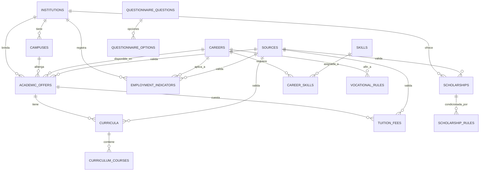

# Diccionario y Arquitectura de Base de Datos

**Motor:** PostgreSQL 17 (Supabase)  
**ORM:** Drizzle ORM  
**Versión de Esquema:** 1.0.0  

---

## 1. Diagrama de Relaciones de Alto Nivel

---

## 2. Definición Detallada de Tablas

### 2.1 Tablas Institucionales y Académicas
* **`institutions`**: Universidades o institutos licenciados.
  - `id`: BIGSERIAL PRIMARY KEY
  - `name`: TEXT NOT NULL
  - `short_name`: TEXT UNIQUE NOT NULL (ej. 'UPC')
  - `institution_type`: TEXT NOT NULL ('PRIVADA_SOCIETARIA', 'PRIVADA_ASOCIATIVA', 'PUBLICA')
  - `description`: TEXT
  - `website_url`: TEXT
  - `logo_url`: TEXT
  - `is_active`: BOOLEAN DEFAULT true

* **`campuses`**: Sedes físicas de cada institución.
  - `id`: BIGSERIAL PRIMARY KEY
  - `institution_id`: BIGINT NOT NULL FK -> `institutions(id)`
  - `name`: TEXT NOT NULL (ej. 'Monterrico', 'San Miguel', 'San Isidro', 'Villa')
  - `address`: TEXT NOT NULL
  - `district`: TEXT NOT NULL
  - `city`: TEXT DEFAULT 'Lima'
  - `latitude`: NUMERIC(10, 7)
  - `longitude`: NUMERIC(10, 7)
  - `map_url`: TEXT
  - `is_active`: BOOLEAN DEFAULT true

* **`careers`**: Carreras profesionales estándar.
  - `id`: BIGSERIAL PRIMARY KEY
  - `name`: TEXT NOT NULL
  - `slug`: TEXT UNIQUE NOT NULL (ej. 'ingenieria-de-sistemas-de-informacion')
  - `faculty`: TEXT NOT NULL
  - `description`: TEXT NOT NULL
  - `duration_semesters`: INTEGER DEFAULT 10
  - `duration_years`: NUMERIC(4,2) DEFAULT 5.0
  - `degree`: TEXT NOT NULL
  - `license_or_accreditation`: TEXT (ej. 'ABET, SINEACE')
  - `general_profile`: TEXT
  - `general_work_fields`: TEXT[] (Array de áreas de desempeño)
  - `is_active`: BOOLEAN DEFAULT true

* **`academic_offers`**: Unión cardinal sede + carrera + modalidad.
  - `id`: BIGSERIAL PRIMARY KEY
  - `institution_id`: BIGINT NOT NULL FK -> `institutions(id)`
  - `campus_id`: BIGINT NOT NULL FK -> `campuses(id)`
  - `career_id`: BIGINT NOT NULL FK -> `careers(id)`
  - `modality`: TEXT NOT NULL ('PRESENCIAL', 'SEMIPRESENCIAL', 'VIRTUAL')
  - `admission_status`: TEXT DEFAULT 'ACTIVE'
  - `official_url`: TEXT
  - CONSTRAINT: `UNIQUE(institution_id, campus_id, career_id, modality)`

* **`sources`**: Trazabilidad y fuentes de verdad verificadas.
  - `id`: BIGSERIAL PRIMARY KEY
  - `source_name`: TEXT NOT NULL
  - `publisher`: TEXT NOT NULL (ej. 'UPC Transparencia', 'MTPE Mi Carrera')
  - `url`: TEXT NOT NULL
  - `source_type`: TEXT ('PORTAL_OFICIAL', 'RESOLUCION', 'ESTUDIO_MERCADO', 'SUNEDU')
  - `published_date`: DATE
  - `accessed_at`: TIMESTAMPTZ DEFAULT now()
  - `valid_until`: DATE
  - `document_version`: TEXT
  - `notes`: TEXT

---

### 2.2 Tablas Curriculares y Económicas
* **`curricula`**: Mallas de planes de estudio vigentes.
  - `id`: BIGSERIAL PRIMARY KEY
  - `academic_offer_id`: BIGINT NOT NULL FK -> `academic_offers(id)`
  - `version_name`: TEXT NOT NULL (ej. 'Plan 2024-2026')
  - `academic_year`: INTEGER NOT NULL
  - `is_current`: BOOLEAN DEFAULT true
  - `source_id`: BIGINT FK -> `sources(id)`

* **`curriculum_courses`**: Cursos individuales por ciclo formativo.
  - `id`: BIGSERIAL PRIMARY KEY
  - `curriculum_id`: BIGINT NOT NULL FK -> `curricula(id)`
  - `cycle`: INTEGER NOT NULL (1 al 10)
  - `course_code`: TEXT
  - `course_name`: TEXT NOT NULL
  - `credits`: NUMERIC(4, 2)
  - `course_type`: TEXT ('OBLIGATORIO', 'ELECTIVO', 'GENERAL')
  - `prerequisite`: TEXT

* **`tuition_fees`**: Estructura de pensiones y aranceles referenciales.
  - `id`: BIGSERIAL PRIMARY KEY
  - `academic_offer_id`: BIGINT NOT NULL FK -> `academic_offers(id)`
  - `category`: TEXT (ej. 'T-U', 'T-V', 'T-W', 'Regular')
  - `concept`: TEXT NOT NULL ('Pensión Mensual (5 cuotas)', 'Matrícula')
  - `amount`: NUMERIC(10, 2) NOT NULL
  - `currency`: TEXT DEFAULT 'PEN'
  - `academic_year`: INTEGER DEFAULT 2026
  - `valid_from`: DATE
  - `valid_until`: DATE
  - `conditions`: TEXT
  - `source_id`: BIGINT FK -> `sources(id)`

---

### 2.3 Tablas Vocacionales y de Orientación
* **`skills`**: Habilidades y competencias analizadas.
  - `id`: BIGSERIAL PRIMARY KEY
  - `name`: TEXT NOT NULL
  - `category`: TEXT ('TECNICA', 'ANALITICA', 'COMUNICATIVA', 'LIDERAZGO')
  - `description`: TEXT

* **`career_skills`**: Ponderación de habilidades por carrera.
  - `id`: BIGSERIAL PRIMARY KEY
  - `career_id`: BIGINT NOT NULL FK -> `careers(id)`
  - `skill_id`: BIGINT NOT NULL FK -> `skills(id)`
  - `weight`: NUMERIC(3, 2) NOT NULL (0.00 a 1.00)

* **`questionnaire_questions`**: Banco de preguntas del test vocacional.
  - `id`: BIGSERIAL PRIMARY KEY
  - `code`: TEXT UNIQUE NOT NULL
  - `dimension`: TEXT NOT NULL ('REALISTIC', 'INVESTIGATIVE', 'ARTISTIC', 'SOCIAL', 'ENTERPRISING', 'CONVENTIONAL', 'TECH', 'LOGIC')
  - `question_text`: TEXT NOT NULL
  - `order_number`: INTEGER NOT NULL
  - `is_active`: BOOLEAN DEFAULT true

* **`questionnaire_options`**: Opciones de respuesta por pregunta con scoring multivariado.
  - `id`: BIGSERIAL PRIMARY KEY
  - `question_id`: BIGINT NOT NULL FK -> `questionnaire_questions(id)`
  - `option_text`: TEXT NOT NULL
  - `score_payload`: JSONB NOT NULL (ej. `{"TECH": 3, "INVESTIGATIVE": 2}`)

* **`vocational_rules`**: Reglas de afinidad carrera-perfil.
  - `id`: BIGSERIAL PRIMARY KEY
  - `career_id`: BIGINT NOT NULL FK -> `careers(id)`
  - `dimension`: TEXT NOT NULL
  - `weight`: NUMERIC(3, 2) NOT NULL
  - `min_score`: NUMERIC(5, 2) DEFAULT 0
  - `explanation_template`: TEXT NOT NULL

---

### 2.4 Tablas de Sesión y Asistente IA
* **`user_sessions`**: Almacenamiento de sesiones temporales sin login.
  - `id`: UUID PRIMARY KEY DEFAULT gen_random_uuid()
  - `session_token`: TEXT UNIQUE NOT NULL
  - `answers_payload`: JSONB
  - `profile_result`: JSONB
  - `created_at`: TIMESTAMPTZ DEFAULT now()
  - `expires_at`: TIMESTAMPTZ DEFAULT (now() + INTERVAL '7 days')

* **`chat_knowledge`**: Conocimiento curado para RAG y Tool Calling.
  - `id`: BIGSERIAL PRIMARY KEY
  - `entity_type`: TEXT NOT NULL ('CAREER', 'CAMPUS', 'SCHOLARSHIP', 'TUITION')
  - `entity_id`: BIGINT
  - `title`: TEXT NOT NULL
  - `content`: TEXT NOT NULL
  - `keywords`: TEXT[]
  - `search_vector`: TSVECTOR
  - `source_id`: BIGINT FK -> `sources(id)`

* **`school_reference`**: Colegios de referencia para estimación de distancias.
  - `id`: BIGSERIAL PRIMARY KEY
  - `name`: TEXT NOT NULL
  - `district`: TEXT NOT NULL
  - `city`: TEXT DEFAULT 'Lima'
  - `latitude`: NUMERIC(10, 7)
  - `longitude`: NUMERIC(10, 7)
