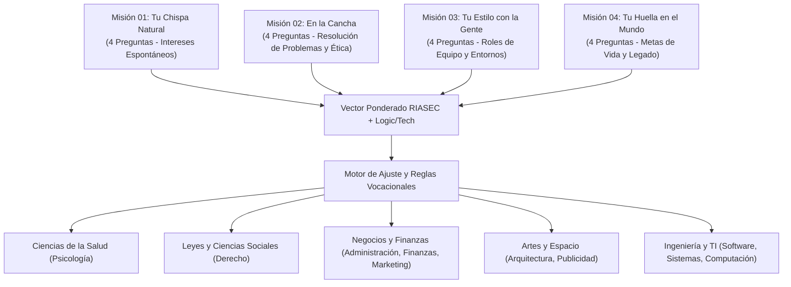

# Marco Metodológico y Psicométrico: Holland RIASEC + Calibración Multidisciplinaria

**Proyecto:** Orientador Vocacional IA — Sistema de Exploración Vocacional Asistido por IA  
**Versión Metodológica:** 3.0 (Calibración Balanceada y Multidisciplinaria)  
**Fecha de Publicación:** Octubre 2026  
**Clasificación:** Marco Científico y de Dominio  

---

## 1. Fundamentación Teórica: El Modelo Tipológico de John L. Holland (RIASEC)

El modelo de **John L. Holland (1997)** constituye el estándar de oro internacional en psicología vocacional y orientación profesional. Su premisa fundamental postula que:
1. Las personalidades individuales pueden clasificarse en **seis tipos vocacionales primarios**:
   * **Realista (R):** Interés por actividades prácticas, motrices, diseño constructivo y tecnología aplicada.
   * **Investigador (I):** Interés por el análisis científico, resolución de enigmas cognitivos, medicina y profundización teórica.
   * **Artístico (A):** Expresión creativa, diseño visual, comunicación transmedia, estética y pensamiento lateral.
   * **Social (S):** Vocación de servicio, salud mental, empatía, enseñanza, orientación y desarrollo humano.
   * **Emprendedor (E):** Liderazgo, persuasión, gestión estratégica, visión comercial y toma de decisiones ejecutivas.
   * **Convencional (C):** Organización, gestión de procesos, finanzas, precisión cuantitativa y auditoría normativa.

2. La congruencia entre la personalidad del individuo y el entorno ocupacional/académico predice de forma directa la **satisfacción académica, el rendimiento y la reducción drástica de la deserción universitaria**.

---

## 2. Calibración Multidisciplinaria y Eliminación de Sesgos

En iteraciones preliminares de tests computacionales, suele ocurrir un sesgo inadvertido hacia áreas de tecnologías de la información (TI) debido a la terminología empleada. 

En la versión **3.0**, se implementó un **diseño factorial balanceado** en las 16 decisiones del cuestionario:

### Distribución Equitativa de Opciones (64 Opciones Totales)
Cada una de las 16 preguntas presenta 4 opciones balanceadas que miden dimensiones contrastantes con cargas psicométricas equivalentes ($P \in [20, 25]$ puntos por ítem principal).

---

## 3. Formulación Matemática del Algoritmo de Scoring

### 3.1. Sumatoria Bruta de Puntuaciones por Dimensión
Sea $A = \{a_1, a_2, \dots, a_{16}\}$ el conjunto de opciones seleccionadas por el estudiante. Para cada dimensión $d \in \mathcal{D}$:

$$\text{RawScore}(d) = \sum_{i=1}^{16} \text{Payload}(a_i, d)$$

### 3.2. Normalización Min-Max Acotada
Para evitar que dimensiones con diferente cardinalidad distorsionen el perfil, se normaliza el puntaje respecto al techo psicométrico máximo calibrado ($\text{MaxCap}_d \in [120, 140]$):

$$\text{ScoreNorm}(d) = \min\left(99, \max\left(0, \text{round}\left(\frac{\text{RawScore}(d)}{\text{MaxCap}_d} \times 100\right)\right)\right)$$

### 3.3. Compatibilidad con Carreras Universitarias
Cada carrera $C_k$ posee un conjunto de reglas de validación $R(C_k) = \{(d_j, w_j, \theta_j)\}$ donde $w_j$ representa la ponderación de la dimensión y $\theta_j$ es el umbral de corte mínimo:

$$\text{WeightedScore}(C_k) = \sum_{(d_j, w_j, \theta_j) \in R(C_k)} \mathbb{I}(\text{RawScore}(d_j) \ge \theta_j) \cdot (\text{ScoreNorm}(d_j) \times w_j)$$

$$\text{Match}\%(C_k) = \min\left(98, \text{round}\left(\frac{\text{WeightedScore}(C_k)}{\sum w_j \times 100} \times 100\right)\right)$$

---

## 4. Validación Psicométrica para Jurado y Sustentación Universitaria

1. **Cero Alucinaciones:** Las sugerencias de carreras no son generadas por un LLM libre, sino por el motor determinístico de compatibilidad auditado contra la base de datos de Supabase.
2. **Explicabilidad Psicométrica (XAI):** Cada porcentaje de afinidad se acompaña de la plantilla de justificación vocacional que explica exactamente por qué los rasgos del postulante encajan con las exigencias curriculares de dicha carrera.
3. **Equilibrio Interdisciplinario:** Garantiza que un estudiante con perfil humanista, artístico o de negocios reciba el mismo nivel de precisión y rigor que un perfil tecnológico.
